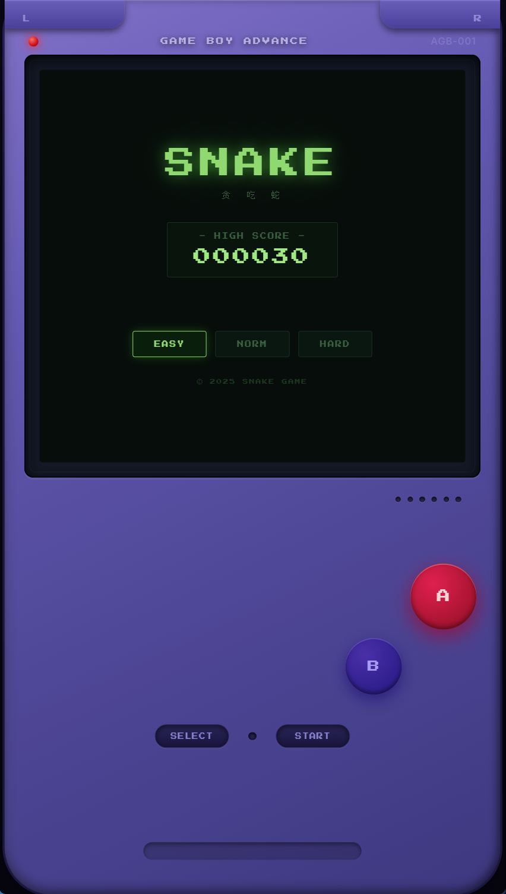
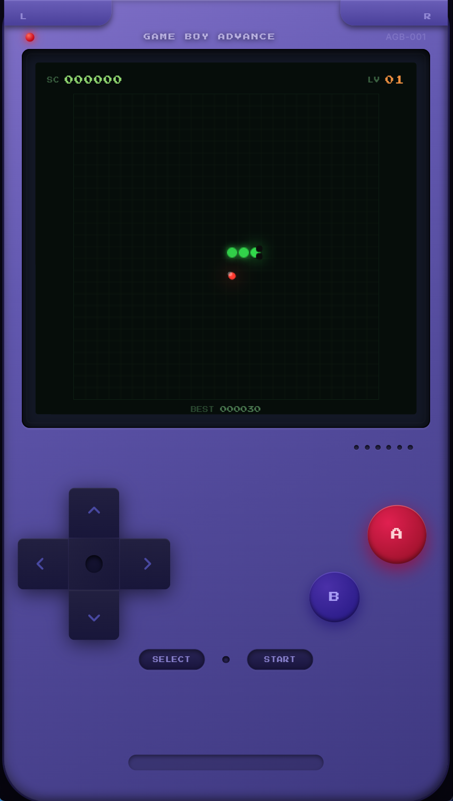
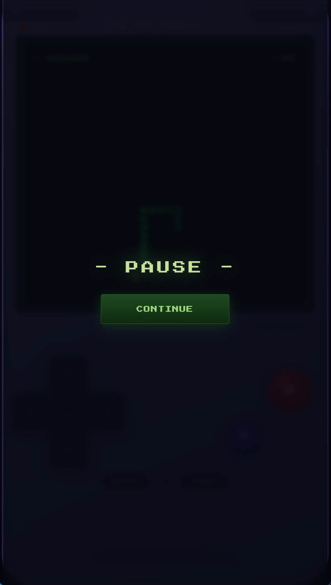
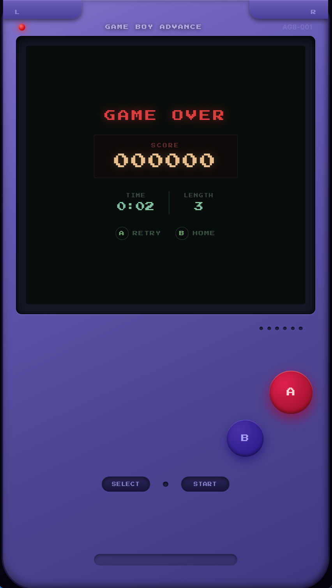

# 🎮 Snake — 复古 GBA 贪吃蛇

一款以**复古 Game Boy Advance** 为外观主题的贪吃蛇网页游戏，基于 React + Canvas 构建。

---

## 截图预览

<table>
  <tr>
    <td align="center"><b>开始界面</b></td>
    <td align="center"><b>游戏中</b></td>
    <td align="center"><b>暂停</b></td>
    <td align="center"><b>游戏结束</b></td>
  </tr>
  <tr>
    <td></td>
    <td></td>
    <td></td>
    <td></td>
  </tr>
</table>

---

## 功能特性

- **复古 GBA 外观** — 紫蓝渐变机身、L/R 肩键、嵌入式 LCD 屏幕、椭圆形 START/SELECT
- **像素字体** — 全程使用 Press Start 2P 点阵字体
- **三档难度** — EASY / NORM / HARD，速度随等级自动提升
- **等级系统** — 每得 100 分升一级，蛇速随之加快
- **音效** — Web Audio API 合成吃食音效
- **最高分记录** — 自动存储到 `localStorage`，刷新不丢失
- **暂停功能** — START / SELECT 键或空格键暂停，画面模糊遮罩
- **全平台输入** — 键盘方向键 / WASD + 屏幕方向键点击
- **响应式缩放** — 整机按比例缩放适配任意窗口尺寸

---

## 快速开始

### 安装依赖

```bash
cd snake-react
npm install
```

### 开发模式

```bash
npm run dev
```

浏览器打开 `http://localhost:5173`

### 构建产物

```bash
npm run build
# 产物输出至 snake-react/dist/
```

### 本地预览构建版

```bash
npm run preview
```

---

## 操作说明

| 操作 | 键盘 | 屏幕按键 |
|------|------|----------|
| 移动方向 | `↑ ↓ ← →` / `W A S D` | 十字键 |
| 开始游戏 | `Enter` | `START` 或 `A` |
| 暂停 / 继续 | `Space` / `Esc` | `START` 或 `SELECT` |
| 再玩一次 | `Enter` | `A` |
| 返回主页 | — | `B` |

---

## 项目结构

```
snake-react/
├── index.html
└── src/
    ├── main.jsx
    ├── App.jsx                  # GBA 机身框架 + 全局按键逻辑
    ├── index.css                # GBA 外观样式（机身、肩键、按钮）
    ├── styles/
    │   └── variables.css        # 颜色变量 + 字体变量
    ├── hooks/
    │   └── useGameState.js      # 游戏核心逻辑（蛇、食物、计分、音效）
    └── components/
        ├── StartScreen.jsx/css  # 开始界面
        ├── GameScreen.jsx/css   # 游戏界面（分数 + Canvas）
        ├── GameOverScreen.jsx/css # 结束界面
        └── Dpad.jsx/css         # GBA 十字方向键
```

---

## 技术栈

| 技术 | 用途 |
|------|------|
| React 19 | UI 框架 |
| HTML5 Canvas | 游戏渲染（蛇身、食物、网格） |
| Web Audio API | 吃食音效合成 |
| CSS Modules | 组件样式隔离 |
| Vite 8 | 构建工具 |
| Press Start 2P | 像素字体（Google Fonts） |

---

## 评分规则

```
得分 = 10 × 当前等级
等级 = floor(总分 / 100) + 1
速度 = max(50ms, 基础速度 − (等级 − 1) × 8ms)
```

基础速度：EASY 180ms / NORM 120ms / HARD 75ms

---

## License

MIT
